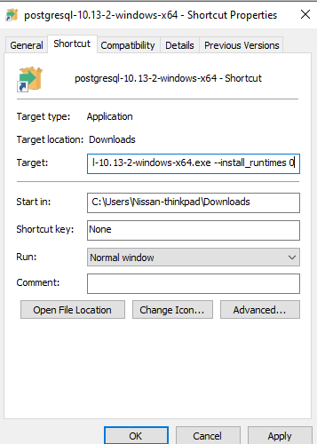
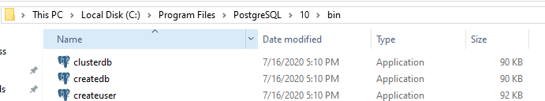
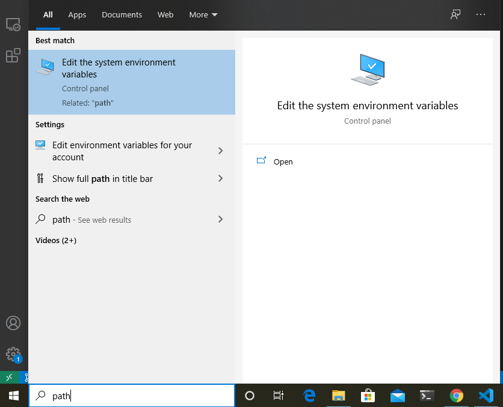
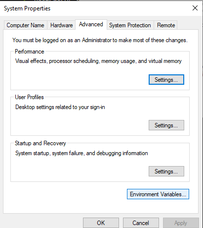
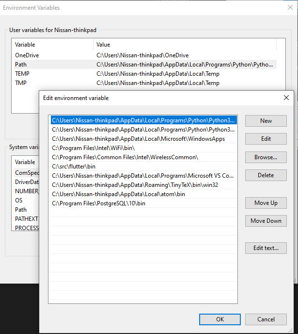
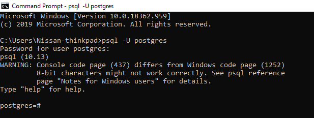
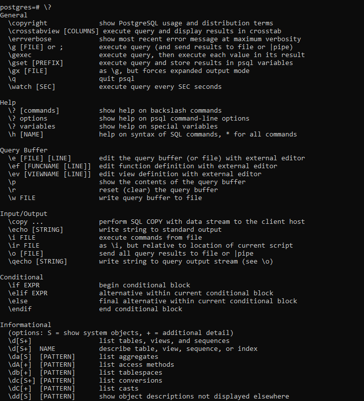
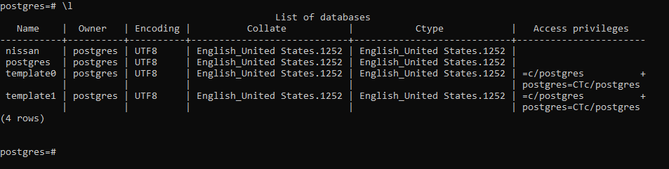
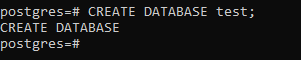
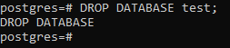

# Postgresql Cheatsheet 
### by Nissan Devnath
#### prepared for **Brilliant Cloud Research Team**

## Installing PostgreSQL in Windows 10
To download Postgresql visit their official [website](https://www.postgresql.org/download/)

> If theres some error during installation saying vc++ not installed then follow these steps

* Create a shourtcut of the downloaded file.  
* Go to the properties of the shourcut and in the target field add this line ```--install_runtimes 0``` 



* Now install

## Adding PostgreSQL to Path variable

To add PostgreSQL to the path we have to copy the path to PostGreSQL installation directory to the path variable.

* First we have to copy the path to the bin folder in the installation directory.


* Then we open the System Environment Variables Setting


* Then we go to the **Environment Variables** option


* Then we add a new line to the Path and paste our copies directory path



Now we can access PostgreSQL from Commandline interface. 

## Acessing PostgreSQL local database

When we install PostgreSQL the default username is postgres. So to login as the default user we use the command

` psql -U postgres`

After that we will have to provide the password that we set during installation . Then we will be logged in as default user.



To get help we have to type:

`\?`



## Creating and Inserting data into database

To get the list of all the data bases we have to type:

`\l`



If we want to create a new database we have to type:

`CREATE DATABASE database_name;`

Let's say we want to create a database named **test** . So we have to type:

`CREATE DATABASE test;`



To drop or delet a database we have to type:

`DROP DATABASE database_name;`

So, if we want to drop the **test** database that we created we have to type:

`DROP DATABASE test;`



To connect to a database we have to type:

`\c database_name`

Let's say we want to connect to a database named **nissan** ,then we have to type:

`\c nissan`


### Creating a table in a database

To create a table we have to type :

```sql
CREATE TABLE table_name(
    column_name data_type constraints(if any)
);
```
Let's say we want to create a table named **person** with the columns of **id** which is a *integer* datatype, **first_name, last_name** and **gender** which are of type *charachter(varchar)* and date_of_birth which is of type *DATE* . So we have to type:

```sql
CREATE TABLE person (
   id INT,
   first_name VARCHAR(50),
   last_name VARCHAR(50),
   gender VARCHAR(8),
   date_of_birth DATE 
);
```
This command will create a table without any constrains which means that if we want we can insert a empty entry into the table. So to avoid these situations we want to creata a table with constraints in that way we can't insert a blank entry into the table .

If we want to create the same table with constraints then we would have to type:
```sql
CREATE TABLE person(
    id BIGSERIAL NOT NULL PRIMARY KEY,
    first_name VARCHAR(50) NOT NULL,
    last_name VARCHAR(50) NOT NULL,
    gender VARCHAR(8) NOT NULL,
    date_of_birth DATE NOT NULL,
    email VARCHAR(100), 
);
```

In the above command we created a table similar to the one before but we have added constraints to the table like we have added `NOT NULL` to id,first_name, last_name, gender, date_of_birth but we have to added any constraints to the email column. So if we want we can make a new entry in the **person** column without giving an email id . Moreover we have added data type of *BIGSERIAL* to the id column and made it a `PRIMARY KEY`, which means id column will have an auto increasing value with every entry in the table and as it's a primary key it'll have unique value by which we can uniquely identify an entry.

### Inserting records into the table

To insert records into the table we have to type in the format:
```sql
INSERT INTO person(
    column_names
) 
VALUES (column_values);
```
In our case if we want to insert a record into our previously created table then we have to type:
```sql
INSERT INTO person(
    first_name,
    last_name,
    gender,
    date_of_birth,
    email
) VALUES('Nissan', 'Devnath', 'MALE', DATE '1998-03-23', 'xyz@mail.com');
```

This will create an entry into the table with the first_name of Nissan, last_name of Devnath, gender of MALE, date_of_birth 1998-03-23 and email of xyz@mail.com . But in the insert command we didn't give any **id** value because the id value is a BIGSERIAL as a result it will increment automatically in every entry.

### Executing commands from a SQL file

To execute commands from a SQL file we have to give the command:

```
\i file_name
```

Let's say we want to execute commands from a file named `person.sql` then we would have to type:
```
\i person.sql
```
Sometimes in Windows when we want to execute a file from this will give an error saying `Access Denied` . In that case we would have to encapsulate the file name in single quotes like below:
```
\i 'person.sql'
```

### Querying records from table

To see an entire table we have to type:
```sql
SELECT * FROM table_name;
```
Here `*` means every column of the table .
So let's say we want to see the entire table named `person`. Then we would have to type:

```sql
SELECT * FROM person;
```

Now if we don't want to see the entire table but only one or two specific column then we would have to type:

```sql
SELECT column_names FROM table_name;
```
So, if we want to query two column named **first_name** and **last_name** then we would have to type:
```sql
SELECT first_name, last_name FROM person;
```

### Querying data in ascending or descending order

To query data and show the result in ascending or descending order we use the command `ORDER BY` . `ORDER BY` takes a certain column and sorts the table according to the column.
```sql
SELECT * FROM table_name ORDER BY column_name;
``` 
Now, if we want to order our `person` table query using the column `country_of_birth`, we would have to type:
```sql
SELECT * FROM person ORDER BY country_of_birth;
```
This command will show the query in ascending order of the column `country_of_birth` . Ascending is the default order if we don't specify anything. If we wanted to order the query is descending order, we have to type:
```sql
SELECT * FROM person ORDER BY country_of_birth DESC;
```
The keyword for ascending is `ASC` and for descending `DESC`.

### Getting unique values from a column

To get the unique values from a column we have to type:
```sql
SELECT DISTINCT column_name FROM table_name;
```
So let's say we want to get the country names(`country_of_birth` column) of all the person in the table. But we want a country to appear once meaning we want unique country names only. Then we have to type:
```sql
SELECT DISTINCT country_of_birth FROM person;
```
We can add a order by with this sql command:
```sql
SELECT DISTINCT country_of_birth FROM person ORDER BY country_of_birth;
```

### Querying specific rows by values of columns

To query a table and see all the data which have a certain value in a certain column,we have to type:
```sql
SELECT * FROM table_name WHERE column_name=value ;
```
Let's say we want to see all the rows in the table person where `gender` column value is **Male**. So, to do that we have to type:
```sql
SELECT * FROM person WHERE gender='Male';
```
We can filter this search by multiple criteria using the `AND` command.
Let's say apart from getting all the **Male** row we want to see only rows which have **Bangladesh** as the `country_of_birth` .For that we have to type:
```sql
SELECT * FROM person WHERE gender='Male' AND country_of_birth='Bangladesh';
```
We can also implement `OR` logic in `WHERE` command. If we want to see all the rows with **gender** equal to `Male` and country_of_birth equal to either Bangladesh or China, Then we have to type:
```sql
SELECT * FROM person WHERE gender='Male' AND (country_of_birth='Bangladesh' OR country_of_birth='China');
```
In this way we can filter our search using multiple parameters.

### Query only specific number of rows

To query only a specific number of rows, we have to use `LIMIT` command .The general format is:
```sql
SELECT * FROM table_name LIMIT number_of_rows;
```
Let's say we want to see only the first 20 entries of a table, then we would have to type:
```sql
SELECT * FROM person LIMIT 20;
```

#### OFFSET

If we want to skip some rows of a query then we would have to use the command `OFFSET`. Let's say we want to skip the first 5 rows, then we would have to type:
```sql
SELECT * FROM person OFFSET 5;
```

Although, `OFFSET` is an useful command. But the standard is to use `FETCH` command. The command should be given like below:
```sql
SELECT * FROM table_name FETCH FIRST number_of_rows ROW ONLY;
```
Let's say we want to get the first 5 rows of the table `person`, then we would have to type:
```sql
SELECT * FROM person FETCH FIRST 5 ROW ONLY;
```
#### IN
The `IN` command is very helpful if we want to select multiple values from a column. 
Let's say we want to see all the rows which have a country_of_birth value of either Germany, Bangladesh or Turkey, then using the `OR` command we would have to type:
```sql
SELECT * FROM person WHERE 
country_of_birth='Bangladesh' OR country_of_birth='Germany' OR country_of_birth='Turkey';
```
This seems very lengthy but we can do the same thing using the `IN` command like below:
 ```sql
 SELECT * FROM person WHERE country_of_birth IN ('Bangladesh','Germany','Turkey');
 ```
 So the general format of the `IN` command is:
 ```sql
  SELECT * FROM person WHERE table_name IN (values);
 ```

 #### BETWEEN
We can use the `BETWEEN` command to select rows by the value of a specific column between some values.
Let's say we want to get all the rows that have a `date_of_birth` column value between 01 January 2000 to 01 January 2013 then we would have to type:
```sql
SELECT * FROM person WHERE date_of_birth BETWEEN DATE '2000-01-01' AND '2013-01-01';
```
#### LIKE
Using the `LIKE` command we can target values with specific pattern. Let's say we want to get all the rows which had a `email` address that ends with **@google.com**. Then we can use the command like below:
```sql
SELECT * FROM person WHERE email LIKE '%@google.com';
```
In the above command `%` is the wildcard character . Which means '%' represents any number of unknow characters.

There's another wildcard character `_` which means one character . Let's say we want all rows which had an email address of five characters followed by @ like `abcde@mail.com` then we would have to type:
```sql
SELECT * FROM person WHERE email LIKE '_____@%';
```
In the above command the five dash means five charachter followed by an `@` and any number of charachter after that which is represented by `@` .
We can also use the command `ILIKE` which is not case sensitive.
Let's say we want all rows which have a country_of_birth name that starts with uppercase **P** then using the `LIKE` command we would have to type:
```sql
SELECT * FROM person WHERE country_of_birth LIKE 'P%';
```
But if we used `ILIKE` instead, then we would have to type:
```sql
SELECT * FROM person WHERE country_of_birth ILIKE 'p%';
```
Look how we used lowercase `p` in the `ILIKE` command as it's not case sensitive.

### GROUP BY
`GROUP BY` is a very powerful command it can make groups by column values. It will be clear if we use an example.
Let's say we want to group our query result by **country** name and count how many entries are from each country then we would use the `GROUP BY` command like below:
```sql
SELECT country_of_birth, COUNT(*) FROM person GROUP BY country_of_birth;
```
