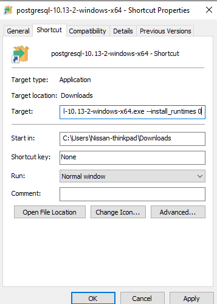

# Postgresql Cheatsheet 
### by Nissan Devnath
#### prepared for **Brilliant Cloud Research Team**

## Installing Postgresql in Windows 10
To download Postgresql visit their official [website](https://www.postgresql.org/download/)

> If theres some error during installation saying vc++ not installed then follow these steps

* Create a shourtcut of the downloaded file.  
* Go to the properties of the shourcut and in the target field add this line ```--install_runtimes 0``` 



* Now install

