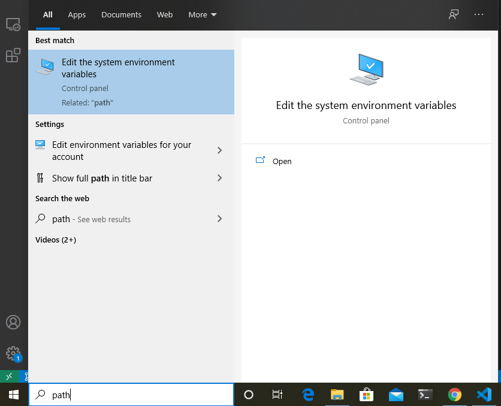
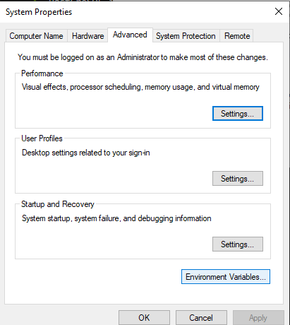
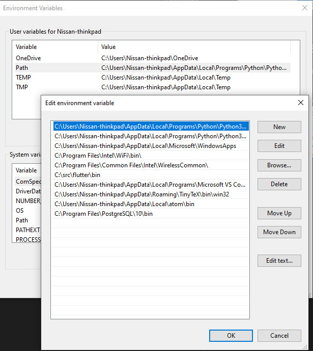
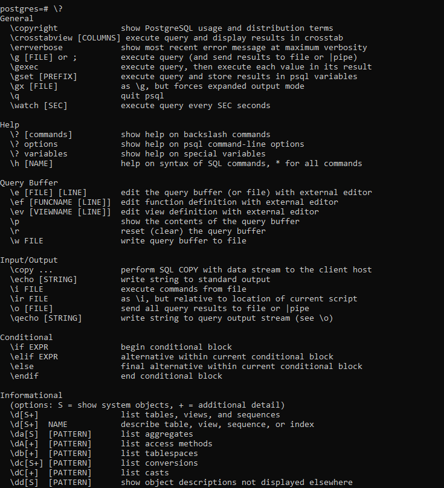

# Postgresql Cheatsheet 
### by Nissan Devnath
#### prepared for **Brilliant Cloud Research Team**

## Installing PostgreSQL in Windows 10
To download Postgresql visit their official [website](https://www.postgresql.org/download/)

> If theres some error during installation saying vc++ not installed then follow these steps

* Create a shourtcut of the downloaded file.  
* Go to the properties of the shourcut and in the target field add this line ```--install_runtimes 0``` 


* Now install

## Adding PostgreSQL to Path variable

To add PostgreSQL to the path we have to copy the path to PostGreSQL installation directory to the path variable.

* First we have to copy the path to the bin folder in the installation directory.


* Then we open the System Environment Variables Setting


* Then we go to the **Environment Variables** option


* Then we add a new line to the Path and paste our copies directory path



Now we can access PostgreSQL from Commandline interface. 

## Acessing PostgreSQL local database

When we install PostgreSQL the default username is postgres. So to login as the default user we use the command

` psql -U postgres`

After that we will have to provide the password that we set during installation . Then we will be logged in as default user.


To get help we have to type:

`\?`



## Creating and Inserting data into database

To get the list of all the data bases we have to type:

`\l`


If we want to create a new database we have to type:

`CREATE DATABASE database_name;`

Let's say we want to create a database named **test** . So we have to type:

`CREATE DATABASE test;`


To drop or delet a database we have to type:

`DROP DATABASE database_name;`

So, if we want to drop the **test** database that we created we have to type:

`DROP DATABASE test;`


To connect to a database we have to type:

`\c database_name`

Let's say we want to connect to a database named **nissan** ,then we have to type:

`\c nissan`


### Creating a table in a database

To create a table we have to type :

```
CREATE TABLE table_name(
    column_name data_type constraints(if any)
);
```
Let's say we want to create a table named **person** with the columns of **id** which is a *integer* datatype, **first_name, last_name** and **gender** which are of type *charachter(varchar)* and date_of_birth which is of type *DATE* . So we have to type:

```
CREATE TABLE person (
   id INT,
   first_name VARCHAR(50),
   last_name VARCHAR(50),
   gender VARCHAR(8),
   date_of_birth DATE 
);
```
